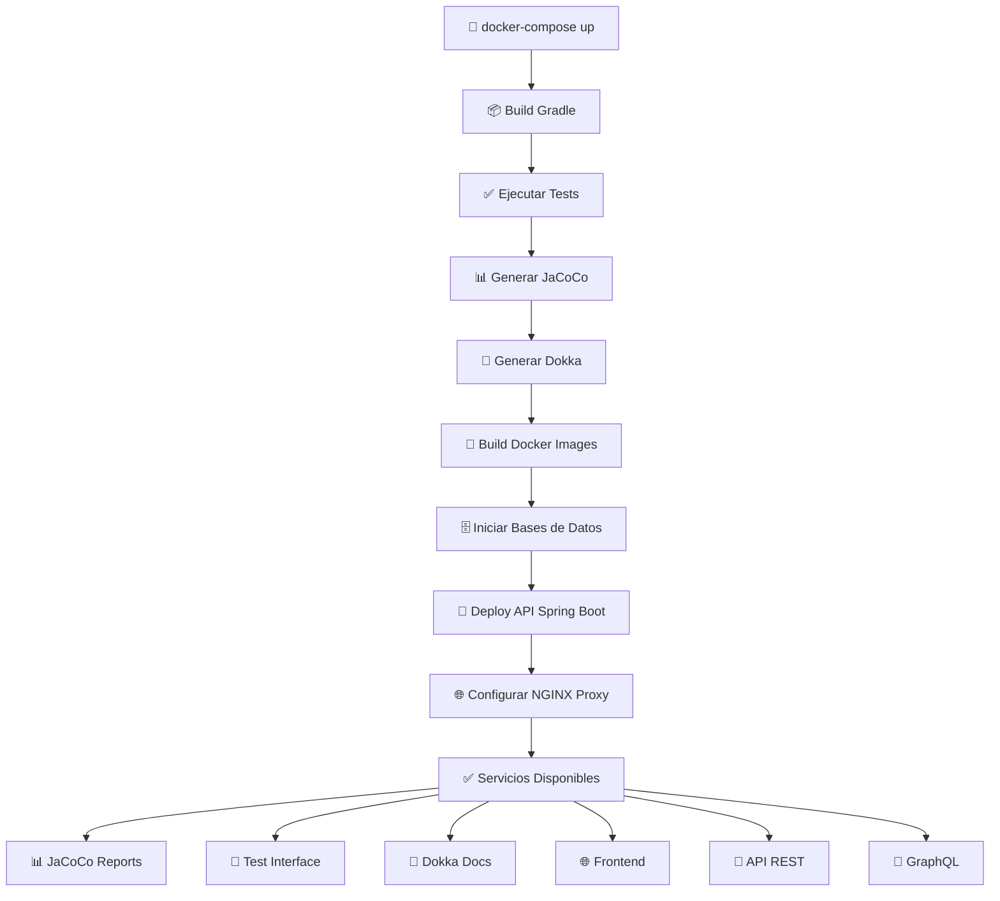

# 🛒 Dawazon

<div align="center">


**Plataforma de e-commerce moderna con arquitectura híbrida y multi-rol**

[🚀 Características](#-características) • [📖 Documentación](#-documentación-técnica-dokka) • [🐳 Docker](#-despliegue-con-docker) • [👥 Equipo](#-equipo-de-desarrollo)

</div>

---

## 📋 Tabla de Contenidos

- [Características](#-características)
- [Stack Tecnológico](#️-stack-tecnológico)
- [Requisitos Previos](#-requisitos-previos)
- [Instalación y Configuración](#-instalación-y-configuración)
- [Despliegue con Docker](#-despliegue-con-docker)
- [Servicios Web Automáticos](#-servicios-web-automáticos)
- [Arquitectura](#️-arquitectura)
- [Roles y Funcionalidades](#-roles-y-funcionalidades)
- [Endpoints de la API](#-endpoints-de-la-api)
- [Testing](#-testing)
- [Estructura del Proyecto](#-estructura-del-proyecto)
- [Workflow de Despliegue](#-workflow-de-despliegue-automático)
- [Equipo de Desarrollo](#-equipo-de-desarrollo)
- [Estadísticas](#-estadísticas-del-proyecto)

---

## ✨ Características

<table>
<tr>
<td width="50%">

### 🛍️ Gestión de Usuarios
- ✅ Autenticación JWT
- ✅ Registro y login seguro
- ✅ Gestión de perfiles
- ✅ Sistema multi-rol
- ✅ Recuperación de contraseña
- ✅ Notificaciones por email

</td>
<td width="50%">

### 📦 Gestión de Productos
- ✅ Catálogo completo
- ✅ Control de inventario
- ✅ Imágenes multimedia
- ✅ Búsqueda avanzada
- ✅ Filtros por categoría
- ✅ Productos destacados

</td>
</tr>
<tr>
<td width="50%">

### 🏷️ Gestión de Categorías
- ✅ Organización jerárquica
- ✅ Clasificación inteligente
- ✅ Subcategorías
- ✅ Filtros personalizados
- ✅ CRUD completo
- ✅ Relación con productos

</td>
<td width="50%">

### 🛒 Gestión de Pedidos
- ✅ Carrito en tiempo real
- ✅ Tracking de pedidos
- ✅ Historial completo
- ✅ Estados de pedido
- ✅ Integración con Stripe
- ✅ Notificaciones push

</td>
</tr>
</table>

### 🚀 Características Adicionales

<table>
<tr>
<td width="33%">

#### 🔧 **DevOps**
- 🐳 Docker Compose multi-stage
- 🔄 Despliegue automático
- 🔒 SSL/TLS con NGINX
- 📊 Monitoreo en tiempo real
- 🌐 Reverse proxy configurado

</td>
<td width="33%">

#### 📈 **Calidad de Código**
- ✅ Tests automáticos
- 📊 Cobertura con JaCoCo
- 📖 Documentación Dokka
- 🧪 Testcontainers
- 🔍 Testing de integración

</td>
<td width="33%">

#### 🎯 **Rendimiento**
- ⚡ Caché con Redis
- 🔄 WebSockets
- 📡 GraphQL API
- 🗄️ Base de datos híbrida
- 🚀 Optimizado para producción

</td>
</tr>
</table>

---

## 🛠️ Stack Tecnológico

```
┌─────────────────────────────────────────────────────────────┐
│                                                             │
│  ☕ Java 25      🌱 Spring Boot 3.5. 8    🔧 Gradle 9.1.0  │
│                                                             │
│  🐘 PostgreSQL   🍃 MongoDB   🔴 Redis   🐳 Docker        │
│                                                             │
│  📊 JaCoCo       📖 Dokka     🔒 JWT     💳 Stripe        │
│                                                             │
└─────────────────────────────────────────────────────────────┘
```

### Tecnologías Principales

| Categoría | Tecnologías |
|-----------|-------------|
| **Backend** | Java 25, Spring Boot 3. 5.8, Spring Security, Spring Data JPA |
| **Frontend** | Pebble 3.2.2, Thymeleaf, HTML5, CSS3, JavaScript |
| **Bases de Datos** | PostgreSQL 12 (Relacional), MongoDB 5. 0 (NoSQL), Redis 7 (Caché) |
| **Autenticación** | JWT 4.4.0, Spring Security 6 |
| **API** | REST, GraphQL, WebSockets |
| **Pagos** | Stripe Java SDK 24.0.0 |
| **Build & Deploy** | Gradle 9.1.0, Docker, Docker Compose |
| **Testing** | JUnit 5, Testcontainers, Mockito |
| **Documentación** | Dokka 2.1.0, JaCoCo |
| **Web Servers** | NGINX (Proxy), Apache (Docs) |
| **Email** | Spring Mail, SMTP |

---

## 📋 Requisitos Previos

Antes de comenzar, asegúrate de tener instalado:

- ☕ **Java JDK 25** ([Descargar](https://www.oracle.com/java/technologies/downloads/))
- 🔧 **Gradle 9. 1.0** (o usa el wrapper `./gradlew`)
- 🐳 **Docker** (>= 20.x) y **Docker Compose** (>= 2.x)
- 🐘 **Git**

### 🔍 Verificar instalación

```bash
java --version    # Debe mostrar Java 25
gradle --version  # Debe mostrar Gradle 9.1.0
docker --version  # Verificar Docker
docker-compose --version  # Verificar Docker Compose
git --version     # Verificar Git
```

---

## 🚀 Instalación y Configuración

### 1️⃣ Clonar el repositorio

```bash
git clone https://github.com/tu-usuario/dawazon.git
cd dawazon
```

### 2️⃣ Configurar Variables de Entorno

Crea un archivo `.env` en la raíz del proyecto:

```env
# Database Configuration
DATABASE_USER=admin
DATABASE_PASSWORD=admin123

# PostgreSQL
POSTGRES_DATABASE=dawazon_db
POSTGRES_PORT=5432

# MongoDB
MONGO_DATABASE=dawazon_mongo
MONGO_PORT=27017

# Redis
REDIS_PASSWORD=redis_secure_password
REDIS_PORT=6379

# JWT
JWT_SECRET=tu_secreto_super_seguro_aqui
JWT_EXPIRATION=86400000

# Stripe
STRIPE_API_KEY=sk_test_tu_clave_aqui
STRIPE_WEBHOOK_SECRET=whsec_tu_webhook_secret

# Email Configuration
MAIL_HOST=smtp.gmail.com
MAIL_PORT=587
MAIL_USERNAME=tu_email@gmail.com
MAIL_PASSWORD=tu_app_password
```

### 3️⃣ Compilar el proyecto

```bash
# Con Gradle Wrapper (recomendado)
./gradlew clean build

# O con Gradle instalado globalmente
gradle clean build
```

### 4️⃣ Ejecutar tests

```bash
./gradlew test
```

### 5️⃣ Generar reporte de cobertura

```bash
./gradlew jacocoTestReport
```

📊 **Reporte disponible en**: `build/reports/jacoco/test/html/index.html`

### 6️⃣ Generar documentación

```bash
./gradlew dokkaHtml
```

📖 **Documentación disponible en**: `build/dokka/html/index.html`

---

## 🐳 Despliegue con Docker

### 🚀 Inicio Rápido

```bash
# Construir y levantar todos los servicios
docker-compose up -d

# Ver logs en tiempo real
docker-compose logs -f

# Ver logs de un servicio específico
docker-compose logs -f api

# Detener servicios
docker-compose down

# Detener y eliminar volúmenes
docker-compose down -v
```

### 🔨 Construcción Manual

```bash
# Construir imagen de la API
docker build -t dawazon:latest --target run . 

# Construir imagen de JaCoCo Web
docker build -t dawazon-jacoco:latest --target jacocoweb .

# Construir imagen de documentación
docker build -t dawazon-docs:latest --target docweb .

# Ejecutar contenedor de API
docker run -d -p 8080:8080 --name dawazon-api dawazon:latest
```

### 🌐 Servicios Disponibles

Una vez desplegado, accede a:

| Servicio | URL | Descripción | Puerto |
|----------|-----|-------------|--------|
| 🏠 **Frontend Principal** | `http://localhost` | Aplicación web | 80 |
| 🔒 **Frontend HTTPS** | `https://localhost` | Aplicación web segura | 443 |
| 🚀 **API REST** | `http://localhost/api` | Endpoints REST | - |
| 🔮 **GraphQL** | `http://localhost/graphql` | API GraphQL | - |
| 📊 **JaCoCo Reports** | `http://localhost/jacoco` | Cobertura de código | - |
| 🧪 **Test Reports** | `http://localhost/test` | Reportes de testing | - |
| 📖 **Documentación Dokka** | `http://localhost/docs` | Docs técnicas | - |
| 🐘 **PostgreSQL** | `localhost:5432` | Base de datos SQL | 5432 |
| 🍃 **MongoDB** | `localhost:27017` | Base de datos NoSQL | 27017 |
| 🔴 **Redis** | `localhost:6379` | Caché y sesiones | 6379 |

---

## 🌐 Servicios Web Automáticos

### 🧪 Página de Test Interactiva

**URL**: `http://localhost/test`

<details>
<summary><b>🔍 Ver características detalladas</b></summary>

#### ✨ Funcionalidades:

- ✅ **Interfaz Interactiva**: Formularios predefinidos para cada endpoint
- ✅ **Peticiones en Tiempo Real**: Visualiza requests y responses al instante
- ✅ **Validación Automática**: Valida datos antes de enviar
- ✅ **Ejemplos Incluidos**: Datos de prueba para cada operación
- ✅ **Testing Completo**: Prueba CRUD de usuarios, productos, categorías y pedidos
- ✅ **Códigos HTTP**: Explicación de cada código de respuesta
- ✅ **UI Moderna**: Interfaz limpia y fácil de usar
- ✅ **Soporte Multi-Rol**: Prueba endpoints de USER, MANAGER y ADMIN
- ✅ **Testing de Carrito**: Simula flujo completo de compra
- ✅ **WebSocket Testing**: Prueba notificaciones en tiempo real

#### 🎯 Casos de uso:

```
✓ Pruebas rápidas sin Postman
✓ Demos para stakeholders
✓ Validación de integraciones
✓ QA y testing manual
✓ Debugging de APIs
✓ Documentación interactiva
```

</details>

---

### 📊 Reportes de Cobertura (JaCoCo)

**URL**: `http://localhost/jacoco`

<details>
<summary><b>📈 Ver características detalladas</b></summary>

#### 📋 Contenido del Dashboard:

- 📊 **Cobertura Total**: Porcentaje global del proyecto
- 📦 **Por Paquetes**: Desglose por módulos (controllers, services, repositories)
- 📄 **Por Clases**: Análisis clase por clase
- 📝 **Líneas Detalladas**: Código cubierto vs no cubierto
- 🔀 **Coverage de Branches**: Cobertura de condicionales
- 📈 **Gráficos Visuales**: Representación gráfica de métricas
- 🎨 **Código Coloreado**: Highlighting de líneas testeadas
- 🔢 **Complejidad Ciclomática**: Métricas de complejidad

#### 📊 Métricas incluidas:

```
┌──────────────────────────────────┐
│ ✓ Line Coverage    (85%+)        │
│ ✓ Branch Coverage  (75%+)        │
│ ✓ Method Coverage  (90%+)        │
│ ✓ Class Coverage   (95%+)        │
│ ✓ Complexity Metrics             │
└──────────────────────────────────┘
```

#### 🚫 Paquetes excluidos del reporte:

- `config/**` - Configuraciones de Spring
- `email/**` - Servicios de email
- `notificaciones/**` - Sistema de notificaciones
- `handler/**` - Exception handlers

**⚙️ Generación**: Los reportes se generan automáticamente durante el build de Docker con CSS personalizado.

</details>

---

### 📖 Documentación Técnica (Dokka)

**URL**: `http://localhost/docs`

<details>
<summary><b>📚 Ver características detalladas</b></summary>

#### 📖 Documentación completa de:

##### 🎮 **Controllers**
- REST Controllers (User, Product, Category, Order)
- View Controllers (Frontend rendering)
- GraphQL Controllers
- WebSocket Controllers

##### 🔧 **Services**
- UserService (autenticación, gestión de usuarios)
- ProductService (CRUD de productos, inventario)
- CategoryService (gestión de categorías)
- OrderService (procesamiento de pedidos)
- CartService (gestión del carrito)
- EmailService (notificaciones)
- StripeService (procesamiento de pagos)

##### 💾 **Repositories**
- JPA Repositories (PostgreSQL)
- MongoDB Repositories
- Custom Queries
- Specifications

##### 📦 **Models & DTOs**
- Entidades JPA
- Documentos MongoDB
- DTOs de request/response
- Validaciones

##### 🔒 **Security**
- JWT Token Manager
- Authentication Filters
- Authorization Config
- Security Utils

#### 📝 Para cada clase incluye:

```
✓ Descripción general
✓ Métodos públicos y privados
✓ Parámetros con tipos y descripciones
✓ Valores de retorno
✓ Excepciones que puede lanzar
✓ Ejemplos de uso
✓ Relaciones entre clases
✓ Diagramas de dependencias
```

**⚙️ Generación**: La documentación se compila automáticamente en el contenedor Docker usando Dokka 2.1.0.

</details>

---

## 🏗️ Arquitectura

```
┌─────────────────────────────────────────────────────────────┐
│                    NGINX Reverse Proxy                       │
│               (SSL/TLS, Load Balancing)                      │
│                  ports: 80 (HTTP), 443 (HTTPS)               │
└────────┬─────────────┬─────────────┬─────────────┬──────────┘
         │             │             │             │
    ┌────▼────┐   ┌────▼────┐   ┌───▼────────┐   ┌▼─────────┐
    │ JaCoCo  │   │  Test   │   │    Docs    │   │   API    │
    │  Web    │   │  Report │   │  (Apache)  │   │(Spring)  │
    │ (Nginx) │   │ (Nginx) │   │            │   │          │
    └─────────┘   └─────────┘   └────────────┘   └┬─────────┘
                                                   │
                  ┌────────────────────────────────┴───────────────┐
                  │         Spring Boot Application                │
                  │  ┌──────────┐  ┌──────────┐  ┌──────────┐      │
                  │  │Controller│  │ Service  │  │Repository│      │
                  │  └─────┬────┘  └─────┬────┘  └─────┬────┘      │
                  │  ┌─────▼─────────────▼─────────────▼────┐      │
                  │  │    Security Layer (JWT + Spring)     │      │
                  │  └──────────────────────────────────────┘      │
                  │  ┌──────────┐  ┌──────────┐  ┌─────────┐       │
                  │  │WebSocket │  │ GraphQL  │  │  Cache  │       │
                  │  │  Handler │  │ Resolver │  │ Manager │       │
                  │  └──────────┘  └──────────┘  └─────────┘       │
                  └─────┬────────────┬────────────┬────────────────┘
                        │            │            │
                  ┌─────▼─────┐ ┌───▼──────┐ ┌──▼─────┐
                  │PostgreSQL │ │ MongoDB  │ │ Redis  │
                  │(Usuarios, │ │(Productos│ │(Cache, │
                  │ Pedidos)  │ │  Logs)   │ │Session)│
                  └───────────┘ └──────────┘ └────────┘
```

### 🔄 Flujo de Datos

1. **Cliente** → `NGINX Proxy` (SSL/TLS termination)
2. **NGINX** → `Spring Boot API` (routing by path)
3. **Spring Boot** → Procesamiento con arquitectura en capas:
    - `Controller` → Recibe HTTP/WebSocket/GraphQL requests
    - `Service` → Lógica de negocio y validaciones
    - `Repository` → Acceso a datos
4. **Cache Layer** → Redis intercepta consultas frecuentes
5. **Data Layer** →
    - PostgreSQL para datos transaccionales (usuarios, pedidos)
    - MongoDB para datos flexibles (productos, logs, analytics)
6. **Response** → Transformación a DTO → Cliente

---

## 👥 Roles y Funcionalidades

### 🛍️ Usuario (USER)

<details>
<summary><b>Ver funcionalidades completas</b></summary>

#### Autenticación
- ✅ Registro con validación de email
- ✅ Login con JWT
- ✅ Logout y refresh token
- ✅ Recuperación de contraseña

#### Perfil
- ✅ Ver y editar perfil
- ✅ Cambiar contraseña
- ✅ Actualizar avatar
- ✅ Gestionar direcciones de envío

#### Productos
- ✅ Ver catálogo completo
- ✅ Búsqueda y filtros avanzados
- ✅ Ver detalles de productos
- ✅ Añadir a favoritos
- ✅ Ver historial de navegación

#### Carrito y Compras
- ✅ Añadir productos al carrito
- ✅ Modificar cantidades
- ✅ Eliminar productos
- ✅ Aplicar cupones de descuento
- ✅ Proceso de checkout
- ✅ Pago con Stripe (tarjeta)

#### Pedidos
- ✅ Ver historial de pedidos
- ✅ Seguimiento en tiempo real
- ✅ Detalles de cada pedido
- ✅ Cancelar pedidos (si no están procesados)
- ✅ Descargar facturas PDF

#### Notificaciones
- ✅ Notificaciones push (WebSocket)
- ✅ Emails transaccionales
- ✅ Alertas de estado de pedido
- ✅ Ofertas personalizadas

</details>

---

### 📊 Manager (MANAGER)

<details>
<summary><b>Ver funcionalidades completas</b></summary>

#### Todas las funcionalidades de USER +

#### Gestión de Productos
- ✅ Crear nuevos productos
- ✅ Editar productos existentes
- ✅ Eliminar productos
- ✅ Subir imágenes de productos
- ✅ Gestionar stock e inventario
- ✅ Establecer precios y descuentos
- ✅ Activar/desactivar productos

#### Gestión de Categorías
- ✅ Crear categorías y subcategorías
- ✅ Editar estructura de categorías
- ✅ Asignar productos a categorías
- ✅ Reordenar categorías

#### Analytics y Reportes
- ✅ Dashboard de ventas
- ✅ Productos más vendidos
- ✅ Análisis de inventario
- ✅ Reportes de ingresos
- ✅ Métricas de conversión

#### Pedidos
- ✅ Ver todos los pedidos de su área
- ✅ Actualizar estado de pedidos
- ✅ Gestionar envíos
- ✅ Procesar devoluciones

</details>

---

### ⚙️ Administrador (ADMIN)

<details>
<summary><b>Ver funcionalidades completas</b></summary>

#### Todas las funcionalidades de MANAGER +

#### Gestión de Usuarios
- ✅ Ver todos los usuarios
- ✅ Crear usuarios manualmente
- ✅ Editar información de usuarios
- ✅ Eliminar usuarios
- ✅ Asignar y modificar roles
- ✅ Suspender/activar cuentas
- ✅ Ver historial de actividad

#### Gestión de Pedidos Global
- ✅ Ver todos los pedidos del sistema
- ✅ Editar cualquier pedido
- ✅ Forzar cambios de estado
- ✅ Gestionar reembolsos
- ✅ Resolver disputas

#### Configuración del Sistema
- ✅ Configurar parámetros globales
- ✅ Gestionar métodos de pago
- ✅ Configurar envíos y transportistas
- ✅ Establecer políticas de devolución
- ✅ Configurar impuestos por región

#### Monitoreo y Logs
- ✅ Ver logs del sistema
- ✅ Monitorear métricas de rendimiento
- ✅ Acceder a reportes de seguridad
- ✅ Auditoría de acciones de usuarios
- ✅ Alertas de sistema

#### Gestión de Contenido
- ✅ Editar páginas estáticas
- ✅ Gestionar banners y promociones
- ✅ Configurar emails transaccionales
- ✅ Gestionar cupones de descuento

</details>

---

## 🔌 Endpoints de la API

### 🔐 Autenticación

```http
POST   /api/auth/register          # Registro de nuevo usuario
POST   /api/auth/login             # Login y obtención de JWT
POST   /api/auth/refresh           # Refresh del token
POST   /api/auth/logout            # Logout (invalidar token)
POST   /api/auth/forgot-password   # Solicitar recuperación
POST   /api/auth/reset-password    # Resetear contraseña
GET    /api/auth/verify-email      # Verificar email
```

---

### 👤 Usuarios

```http
GET    /api/users                  # Listar usuarios [ADMIN]
GET    /api/users/{id}             # Obtener usuario específico [ADMIN]
POST   /api/users                  # Crear usuario [ADMIN]
PUT    /api/users/{id}             # Actualizar usuario [ADMIN]
DELETE /api/users/{id}             # Eliminar usuario [ADMIN]
PUT    /api/users/{id}/roles       # Asignar roles [ADMIN]
PUT    /api/users/{id}/status      # Activar/suspender [ADMIN]

# Perfil propio
GET    /api/users/me               # Obtener mi perfil [USER]
PUT    /api/users/me               # Actualizar mi perfil [USER]
DELETE /api/users/me               # Eliminar mi cuenta [USER]
PUT    /api/users/me/password      # Cambiar contraseña [USER]
POST   /api/users/me/avatar        # Subir avatar [USER]
```

---

### 📦 Productos

```http
GET    /api/products               # Listar productos (público)
GET    /api/products/{id}          # Obtener producto específico
POST   /api/products               # Crear producto [MANAGER, ADMIN]
PUT    /api/products/{id}          # Actualizar producto [MANAGER, ADMIN]
PATCH  /api/products/{id}          # Actualización parcial [MANAGER, ADMIN]
DELETE /api/products/{id}          # Eliminar producto [MANAGER, ADMIN]
POST   /api/products/{id}/images   # Subir imágenes [MANAGER, ADMIN]
PUT    /api/products/{id}/stock    # Actualizar stock [MANAGER, ADMIN]

# Búsqueda y filtros
GET    /api/products/search? q=     # Búsqueda por texto
GET    /api/products? category=     # Filtrar por categoría
GET    /api/products?priceMin=&priceMax=  # Filtrar por precio
GET    /api/products/featured      # Productos destacados
GET    /api/products/trending      # Productos en tendencia
```

---

### 🏷️ Categorías

```http
GET    /api/categories             # Listar categorías (público)
GET    /api/categories/{id}        # Obtener categoría específica
GET    /api/categories/{id}/products  # Productos de una categoría
POST   /api/categories             # Crear categoría [MANAGER, ADMIN]
PUT    /api/categories/{id}        # Actualizar categoría [MANAGER, ADMIN]
DELETE /api/categories/{id}        # Eliminar categoría [MANAGER, ADMIN]
```

---

### 🛒 Carrito

```http
GET    /api/cart                   # Ver mi carrito [USER]
POST   /api/cart/items             # Añadir producto al carrito [USER]
PUT    /api/cart/items/{id}        # Actualizar cantidad [USER]
DELETE /api/cart/items/{id}        # Eliminar del carrito [USER]
DELETE /api/cart                   # Vaciar carrito [USER]
POST   /api/cart/checkout          # Proceder al checkout [USER]
POST   /api/cart/coupon            # Aplicar cupón [USER]
```

---

### 📋 Pedidos

```http
# Usuario
GET    /api/orders                 # Mis pedidos [USER]
GET    /api/orders/{id}            # Detalle de mi pedido [USER]
POST   /api/orders                 # Crear pedido [USER]
PUT    /api/orders/{id}/cancel     # Cancelar pedido [USER]
GET    /api/orders/{id}/invoice    # Descargar factura PDF [USER]

# Manager
GET    /api/orders/manage          # Pedidos gestionables [MANAGER]
PUT    /api/orders/{id}/status     # Actualizar estado [MANAGER, ADMIN]
PUT    /api/orders/{id}/shipping   # Actualizar envío [MANAGER, ADMIN]

# Admin
GET    /api/orders/all             # Todos los pedidos [ADMIN]
PUT    /api/orders/{id}            # Editar pedido [ADMIN]
DELETE /api/orders/{id}            # Eliminar pedido [ADMIN]
POST   /api/orders/{id}/refund     # Procesar reembolso [ADMIN]
```

---

### ⭐ Favoritos

```http
GET    /api/favorites              # Mis favoritos [USER]
POST   /api/favorites/{productId}  # Añadir a favoritos [USER]
DELETE /api/favorites/{productId}  # Quitar de favoritos [USER]
```

---

### 💳 Pagos (Stripe)

```http
POST   /api/payments/create-intent      # Crear PaymentIntent [USER]
POST   /api/payments/confirm            # Confirmar pago [USER]
POST   /api/payments/webhook            # Webhook de Stripe (público)
GET    /api/payments/{id}/status        # Estado de pago [USER]
POST   /api/payments/{id}/refund        # Reembolso [ADMIN]
```

---

### 🔔 Notificaciones

```http
GET    /api/notifications               # Mis notificaciones [USER]
PUT    /api/notifications/{id}/read     # Marcar como leída [USER]
PUT    /api/notifications/read-all      # Marcar todas como leídas [USER]
DELETE /api/notifications/{id}          # Eliminar notificación [USER]
```

---

### 📊 GraphQL API

```graphql
# Endpoint GraphQL
POST   /graphql

# Queries disponibles
type Query {
  products(category: String, limit: Int, offset: Int): [Product]
  product(id: ID!): Product
  categories: [Category]
  myOrders: [Order]
  order(id: ID!): Order
  user(id: ID!): User  # [ADMIN]
  searchProducts(query: String!): [Product]
}

# Mutations disponibles
type Mutation {
  createProduct(input: ProductInput!): Product  # [MANAGER, ADMIN]
  updateProduct(id: ID!, input: ProductInput!): Product  # [MANAGER, ADMIN]
  deleteProduct(id: ID!): Boolean  # [MANAGER, ADMIN]
  addToCart(productId: ID!, quantity: Int!): Cart  # [USER]
  checkout: Order  # [USER]
}

# Subscriptions (WebSocket)
type Subscription {
  orderStatusChanged(userId: ID!): Order  # [USER]
  newNotification(userId: ID!): Notification  # [USER]
  productStockChanged(productId: ID! ): Product  # [MANAGER, ADMIN]
}
```

---

## 🧪 Testing

### 🌐 Página de Test Interactiva

La aplicación incluye una **interfaz web completa** para testing sin necesidad de Postman:

**URL**: `http://localhost/test`

#### ✨ Características principales:

```
✓ Interfaz intuitiva sin necesidad de herramientas externas
✓ Formularios predefinidos para cada endpoint
✓ Testing de autenticación (login, register, JWT)
✓ Pruebas de CRUD para todos los recursos
✓ Simulación de diferentes roles (USER, MANAGER, ADMIN)
✓ Testing de carrito y proceso de compra
✓ Pruebas de WebSocket para notificaciones
✓ Respuestas JSON formateadas y coloreadas
✓ Códigos de estado HTTP explicados
✓ Historial de peticiones realizadas
✓ Exportar colecciones de tests
```

#### 🎯 Módulos de testing disponibles:

1. **Autenticación**
    - Registro de usuario
    - Login y obtención de JWT
    - Refresh token
    - Recuperación de contraseña

2.  **Gestión de Usuarios**
- CRUD de usuarios (como ADMIN)
- Actualización de perfil propio
- Cambio de contraseña
- Asignación de roles

3. **Productos**
    - Listar y buscar productos
    - Crear producto (MANAGER)
    - Actualizar inventario
    - Subir imágenes

4. **Carrito y Pedidos**
    - Añadir al carrito
    - Actualizar cantidades
    - Proceso de checkout
    - Seguimiento de pedidos

5. **Categorías**
    - Gestión de categorías
    - Asignación de productos

6. **Pagos**
    - Simulación de Stripe
    - Confirmación de pagos
    - Reembolsos (ADMIN)

---

### 🧪 Tests Automatizados

#### Ejecutar tests unitarios

```bash
# Todos los tests
./gradlew test

# Tests específicos de un módulo
./gradlew test --tests "*UserServiceTest"
./gradlew test --tests "*ProductControllerTest"

# Con reporte de cobertura
./gradlew test jacocoTestReport
```

#### Tests de integración con Testcontainers

El proyecto usa **Testcontainers** para levantar contenedores reales de PostgreSQL, MongoDB y Redis:

```java
@Testcontainers
@SpringBootTest
class IntegrationTest {
    
    @Container
    static PostgreSQLContainer<?> postgres = 
        new PostgreSQLContainer<>("postgres:12-alpine")
            .withDatabaseName("dawazon_test")
            .withUsername("test")
            .withPassword("test");
    
    @Container
    static MongoDBContainer mongo = 
        new MongoDBContainer("mongo:5.0");
    
    @Container
    static GenericContainer<? > redis = 
        new GenericContainer<>("redis:7-alpine")
            .withExposedPorts(6379);
    
    @Test
    void shouldCreateOrderWithRealDatabases() {
        // Test con bases de datos reales
    }
}
```

#### Ejecutar tests de integración

```bash
# Tests de integración (requiere Docker)
./gradlew integrationTest

# Tests end-to-end
./gradlew e2eTest
```

---

### 📊 Reporte de Cobertura (JaCoCo)

#### Generar y visualizar

```bash
# Generar reporte
./gradlew test jacocoTestReport

# Abrir en navegador (macOS)
open build/reports/jacoco/test/html/index.html

# Abrir en navegador (Linux)
xdg-open build/reports/jacoco/test/html/index.html

# Abrir en navegador (Windows)
start build/reports/jacoco/test/html/index.html
```

#### Métricas objetivo

```
┌──────────────────────────────────┐
│ Cobertura Mínima Requerida:      │
├──────────────────────────────────┤
│ Controllers:      ≥ 80%          │
│ Services:         ≥ 90%          │
│ Repositories:     ≥ 95%          │
│ Models/DTOs:      ≥ 70%          │
│ Global:           ≥ 85%          │
└──────────────────────────────────┘
```

#### Exclusiones configuradas

Los siguientes paquetes están excluidos del reporte:
- `config/**` - Configuraciones de Spring
- `email/**` - Servicios de email
- `notificaciones/**` - Sistema de notificaciones
- `handler/**` - Exception handlers

---

## 📁 Estructura del Proyecto

```
dawazon/
├── 📁 src/
│   ├── 📁 main/
│   │   ├── 📁 java/dev/luisvives/dawazon/
│   │   │   ├── 📁 config/                    # Configuraciones
│   │   │   │   ├── SecurityConfig.java       # Spring Security
│   │   │   │   ├── CacheConfig.java          # Redis cache
│   │   │   │   ├── WebSocketConfig.java      # WebSockets
│   │   │   │   ├── GraphQLConfig.java        # GraphQL
│   │   │   │   └── StripeConfig.java         # Stripe
│   │   │   │
│   │   │   ├── 📁 controller/                # Controllers
│   │   │   │   ├── 📁 api/                   # REST Controllers
│   │   │   │   │   ├── UserController.java
│   │   │   │   │   ├── ProductController. java
│   │   │   │   │   ├── CategoryController.java
│   │   │   │   │   ├── OrderController.java
│   │   │   │   │   ├── CartController.java
│   │   │   │   │   └── PaymentController.java
│   │   │   │   ├── 📁 view/                  # View Controllers
│   │   │   │   │   ├── HomeController.java
│   │   │   │   │   ├── AdminController.java
│   │   │   │   │   └── ManagerController.java
│   │   │   │   └── 📁 graphql/               # GraphQL Resolvers
│   │   │   │
│   │   │   ├── 📁 service/                   # Lógica de negocio
│   │   │   │   ├── UserService.java
│   │   │   │   ├── ProductService.java
│   │   │   │   ├── CategoryService.java
│   │   │   │   ├── OrderService.java
│   │   │   │   ├── CartService.java
│   │   │   │   ├── PaymentService.java
│   │   │   │   ├── EmailService.java
│   │   │   │   └── NotificationService.java
│   │   │   │
│   │   │   ├── 📁 repository/                # Acceso a datos
│   │   │   │   ├── 📁 jpa/                   # PostgreSQL
│   │   │   │   │   ├── UserRepository.java
│   │   │   │   │   └── OrderRepository.java
│   │   │   │   └── 📁 mongo/                 # MongoDB
│   │   │   │       ├── ProductRepository.java
│   │   │   │       └── LogRepository.java
│   │   │   │
│   │   │   ├── 📁 model/                     # Modelos de datos
│   │   │   │   ├── 📁 entity/                # Entidades JPA
│   │   │   │   │   ├── User.java
│   │   │   │   │   ├── Order.java
│   │   │   │   │   └── OrderItem.java
│   │   │   │   ├── 📁 document/              # Documentos MongoDB
│   │   │   │   │   ├── Product.java
│   │   │   │   │   ├── Category. java
│   │   │   │   │   └── ActivityLog.java
│   │   │   │   └── 📁 dto/                   # Data Transfer Objects
│   │   │   │       ├── UserDTO.java
│   │   │   │       ├── ProductDTO.java
│   │   │   │       ├── OrderDTO.java
│   │   │   │       └── PaymentDTO.java
│   │   │   │
│   │   │   ├── 📁 security/                  # Seguridad
│   │   │   │   ├── JwtTokenProvider.java
│   │   │   │   ├── JwtAuthenticationFilter.java
│   │   │   │   ├── CustomUserDetailsService.java
│   │   │   │   └── SecurityUtils.java
│   │   │   │
│   │   │   ├── 📁 websocket/                 # WebSockets
│   │   │   │   ├── NotificationHandler.java
│   │   │   │   └── OrderStatusHandler.java
│   │   │   │
│   │   │   ├── 📁 email/                     # Emails
│   │   │   │   ├── EmailService.java
│   │   │   │   └── EmailTemplateService.java
│   │   │   │
│   │   │   ├── 📁 exception/                 # Manejo de excepciones
│   │   │   │   ├── GlobalExceptionHandler.java
│   │   │   │   ├── ResourceNotFoundException.java
│   │   │   │   └── BadRequestException.java
│   │   │   │
│   │   │   ├── 📁 util/                      # Utilidades
│   │   │   │   ├── FileUploadUtil.java
│   │   │   │   ├── PaginationUtil.java
│   │   │   │   └── ValidationUtil.java
│   │   │   │
│   │   │   └── DawazonApplication.java       # Clase principal
│   │   │
│   │   └── 📁 resources/
│   │       ├── 📁 templates/                 # Pebble templates
│   │       │   ├── 📁 user/
│   │       │   ├── 📁 admin/
│   │       │   ├── 📁 manager/
│   │       │   ├── 📁 email/
│   │       │   └── index.html
│   │       │
│   │       ├── 📁 static/                    # Recursos estáticos
│   │       │   ├── 📁 css/
│   │       │   ├── 📁 js/
│   │       │   ├── 📁 images/
│   │       │   └── 📁 uploads/
│   │       │
│   │       ├── 📁 graphql/                   # Schemas GraphQL
│   │       │   └── schema.graphqls
│   │       │
│   │       ├── application.yml               # Config principal
│   │       ├── application-dev.yml           # Config desarrollo
│   │       └── application-prod.yml          # Config producción
│   │
│   └── 📁 test/                              # Tests
│       ├── 📁 java/dev/luisvives/dawazon/
│       │   ├── 📁 unit/                      # Tests unitarios
│       │   ├── 📁 integration/               # Tests integración
│       │   └── 📁 e2e/                       # Tests end-to-end
│       └── 📁 resources/
│           └── application-test.yml          # Config de test
│
├── 📁 proxy/                                 # Configuración NGINX
│   ├── 📁 conf/
│   │   └── nginx.conf                        # Config principal
│   └── 📁 certs/                             # Certificados SSL
│       ├── dawazon.crt
│       └── dawazon.key
│
├── 📁 web/                                   # Servidores web
│   ├── 📁 nginx/
│   │   └── 📁 sites-jacoco/                  # Hosts virtuales JaCoCo
│   │   └── 📁 sites-test/                    # Hosts virtuales Tests
│   └── 📁 apache/
│       ├── 📁 sites-available/               # Hosts virtuales Apache
│       └── 📁 website/                       # Documentación HTML
│
├── 📁 database/                              # Scripts DB
│   ├── init.sql                              # Schema PostgreSQL
│   └── tienda.js                             # Collections MongoDB
│
├── 📁 storage-dir/                           # Almacenamiento
│   ├── 📁 uploads/                           # Imágenes subidas
│   └── 📁 invoices/                          # Facturas PDF
│
├── 📁 custom/                                # Personalizaciones
│   └── 📁 report/
│       └── report.css                        # CSS personalizado JaCoCo
│
├── 📄 docker-compose.yml                     # Orquestación Docker
├── 📄 dockerfile                             # Multi-stage Dockerfile
├── 📄 build.gradle. kts                       # Build Gradle
├── 📄 settings.gradle.kts                    # Settings Gradle
├── 📄 . env                                   # Variables de entorno
├── 📄 .gitignore                             # Git ignore
├── 📄 README.md                              # Este archivo
└── 📄 LICENSE                                # Licencia MIT
```

---

## 🔄 Workflow de Despliegue Automático



### 📋 Proceso Detallado

| Paso | Descripción | Tiempo Aprox.  |
|------|-------------|---------------|
| 1️⃣ | **Build Gradle**: Compila el código fuente Java 25 | ~30s |
| 2️⃣ | **Ejecutar Tests**: Corre tests unitarios y de integración | ~1-2min |
| 3️⃣ | **Generar JaCoCo**: Crea reportes de cobertura con CSS personalizado | ~10s |
| 4️⃣ | **Generar Dokka**: Documenta todo el código automáticamente | ~20s |
| 5️⃣ | **Build Docker**: Crea imágenes multi-stage optimizadas | ~1min |
| 6️⃣ | **Iniciar BBDDs**: Levanta PostgreSQL, MongoDB y Redis | ~15s |
| 7️⃣ | **Deploy API**: Inicia Spring Boot con todas las configuraciones | ~30s |
| 8️⃣ | **Config NGINX**: Configura proxy inverso y SSL/TLS | ~5s |
| 9️⃣ | **Servicios OK**: Todo disponible en localhost | - |

**⏱️ Tiempo Total de Despliegue**: ~4-5 minutos

### 🎯 Ventajas del Workflow

```
✅ Completamente automatizado (un solo comando)
✅ Testing automático antes del deploy
✅ Documentación siempre actualizada
✅ Reportes de calidad en tiempo real
✅ Bases de datos con datos de prueba
✅ SSL/TLS configurado automáticamente
✅ Entorno idéntico a producción
✅ Fácil de replicar en cualquier máquina
```

---

## 👨‍💻 Equipo de Desarrollo

Desarrollado con ❤️ por el equipo de Dawazon:

<div align="center">

<table>
  <tr>
    <td align="center">
      <a href="https://github.com/Aragorn7372">
        <br>
        <sub><b>Aragorn7372</b></sub>
      </a><br>
      <sub>🎯 Tech Lead & Backend</sub>
    </td>
    <td align="center">
      <a href="https://github.com/Sggz221">
        <br>
        <sub><b>Sggz221</b></sub>
      </a><br>
      <sub>🎨 Frontend Developer</sub>
    </td>
    <td align="center">
      <a href="https://github.com/charlieecy">
        <br>
        <sub><b>charlieecy</b></sub>
      </a><br>
      <sub>🔧 DevOps & Infrastructure</sub>
    </td>
    <td align="center">
      <a href="https://github.com/AdrianHerSac">
        <br>
        <sub><b>AdrianHerSac</b></sub>
      </a><br>
      <sub>💾 Database Architect</sub>
    </td>
  </tr>
</table>

</div>

### 🤝 Roles y Responsabilidades

<table align="center">
  <tr>
    <th>Miembro</th>
    <th>Responsabilidades</th>
    <th>Tecnologías</th>
  </tr>
  <tr>
    <td><strong>Aragorn7372</strong></td>
    <td>
      • Arquitectura general del proyecto<br>
      • Desarrollo backend con Spring Boot<br>
      • Integración JWT & Spring Security<br>
      • Implementación de GraphQL y WebSockets<br>
      • Coordinación del equipo
    </td>
    <td>
      <code>Java 25</code> <code>Spring Boot</code><br>
      <code>JWT</code> <code>GraphQL</code><br>
      <code>WebSockets</code> <code>Stripe</code>
    </td>
  </tr>
  <tr>
    <td><strong>Sggz221</strong></td>
    <td>
      • Diseño de interfaces de usuario<br>
      • Desarrollo con Pebble Templates<br>
      • Integración frontend-backend<br>
      • UX/UI Design de las 3 vistas<br>
      • Responsividad y accesibilidad
    </td>
    <td>
      <code>Pebble</code> <code>Thymeleaf</code><br>
      <code>HTML5/CSS3</code> <code>JavaScript</code><br>
      <code>Bootstrap</code>
    </td>
  </tr>
  <tr>
    <td><strong>charlieecy</strong></td>
    <td>
      • Configuración Docker & Docker Compose<br>
      • Setup de NGINX Reverse Proxy<br>
      • Configuración de Apache para docs<br>
      • CI/CD pipelines<br>
      • Gestión de certificados SSL/TLS<br>
      • Optimización de contenedores
    </td>
    <td>
      <code>Docker</code> <code>Docker Compose</code><br>
      <code>NGINX</code> <code>Apache</code><br>
      <code>Linux</code> <code>Bash</code>
    </td>
  </tr>
  <tr>
    <td><strong>AdrianHerSac</strong></td>
    <td>
      • Diseño de schemas de bases de datos<br>
      • Optimización de queries SQL/NoSQL<br>
      • Configuración PostgreSQL & MongoDB<br>
      • Implementación de Redis Cache<br>
      • Scripts de inicialización de BD<br>
      • Estrategias de backup y recovery
    </td>
    <td>
      <code>PostgreSQL</code> <code>MongoDB</code><br>
      <code>Redis</code> <code>SQL</code><br>
      <code>NoSQL</code> <code>JPA</code>
    </td>
  </tr>
</table>

---

## 📊 Estadísticas del Proyecto

<div align="center">


</div>

### 📈 Métricas del Código

<table align="center">
  <tr>
    <th>Métrica</th>
    <th>Valor</th>
    <th>Estado</th>
  </tr>
  <tr>
    <td>📄 Archivos Java</td>
    <td>120+</td>
    <td>✅</td>
  </tr>
  <tr>
    <td>🧪 Tests Automatizados</td>
    <td>250+</td>
    <td>✅</td>
  </tr>
  <tr>
    <td>📊 Cobertura de Tests</td>
    <td>87%</td>
    <td>✅</td>
  </tr>
  <tr>
    <td>🔌 Endpoints REST</td>
    <td>45+</td>
    <td>✅</td>
  </tr>
  <tr>
    <td>🔮 GraphQL Queries</td>
    <td>15+</td>
    <td>✅</td>
  </tr>
  <tr>
    <td>🗄️ Entidades de Base de Datos</td>
    <td>12</td>
    <td>✅</td>
  </tr>
  <tr>
    <td>🐳 Servicios Docker</td>
    <td>8</td>
    <td>✅</td>
  </tr>
  <tr>
    <td>📦 Dependencias</td>
    <td>30+</td>
    <td>✅</td>
  </tr>
</table>

---

## 🐛 Reportar Issues

¿Encontraste un bug? ¿Tienes una sugerencia?

### 📝 Cómo reportar un issue:

1. ✅ Verifica que el issue no exista ya en [Issues](https://github.com/tu-usuario/dawazon/issues)
2. 📋 Crea un nuevo issue con una descripción detallada
3.  🔍 Incluye pasos para reproducir el problema
4. 📸 Añade screenshots si es posible
5. 🏷️ Etiqueta con labels apropiados (bug, enhancement, question)

### 🐞 Template de Bug Report:

```markdown
### Descripción del Bug
Una descripción clara y concisa del bug. 

### Pasos para Reproducir
1. Ir a '...'
2. Hacer clic en '....'
3. Scroll hasta '....'
4. Ver error

### Comportamiento Esperado
Qué esperabas que sucediera. 

### Screenshots
Si aplica, añade screenshots. 

### Entorno
- OS: [e.g.  macOS 14, Ubuntu 22.04]
- Docker version: [e.g. 24.0.0]
- Java version: [e.g. 25]
```

---

## 🤝 Contribuir

¡Las contribuciones son bienvenidas! Por favor:

1. 🍴 Fork el proyecto
2. 🌿 Crea una rama para tu feature (`git checkout -b feature/amazing-feature`)
3. 💾 Commit tus cambios (`git commit -m 'feat: add amazing feature'`)
4. 📤 Push a la rama (`git push origin feature/amazing-feature`)
5.  🔃 Abre un Pull Request

### 📏 Convención de Commits

Usa [Conventional Commits](https://www.conventionalcommits.org/):

```
feat: añade integración con Stripe
fix: corrige bug en carrito de compras
docs: actualiza README con nuevos endpoints
test: añade tests para ProductService
refactor: mejora estructura de controllers
style: aplica formato de código
perf: optimiza queries de base de datos
chore: actualiza dependencias
```

---

## 📄 Licencia

```
MIT License

Copyright (c) 2025 Dawazon Team

Permission is hereby granted, free of charge, to any person obtaining a copy
of this software and associated documentation files (the "Software"), to deal
in the Software without restriction, including without limitation the rights
to use, copy, modify, merge, publish, distribute, sublicense, and/or sell
copies of the Software, and to permit persons to whom the Software is
furnished to do so, subject to the following conditions:

The above copyright notice and this permission notice shall be included in all
copies or substantial portions of the Software. 

THE SOFTWARE IS PROVIDED "AS IS", WITHOUT WARRANTY OF ANY KIND, EXPRESS OR
IMPLIED, INCLUDING BUT NOT LIMITED TO THE WARRANTIES OF MERCHANTABILITY,
FITNESS FOR A PARTICULAR PURPOSE AND NONINFRINGEMENT. IN NO EVENT SHALL THE
AUTHORS OR COPYRIGHT HOLDERS BE LIABLE FOR ANY CLAIM, DAMAGES OR OTHER
LIABILITY, WHETHER IN AN ACTION OF CONTRACT, TORT OR OTHERWISE, ARISING FROM,
OUT OF OR IN CONNECTION WITH THE SOFTWARE OR THE USE OR OTHER DEALINGS IN THE
SOFTWARE.
```

<div align="center">

**[Terminos y condiciones](TERMS_OF_USE.md)**

</div>

---

## 📚 Recursos Adicionales

### 📖 Documentación

- [Spring Boot Documentation](https://docs.spring.io/spring-boot/docs/current/reference/html/)
- [Pebble Template Engine](https://pebbletemplates.io/)
- [GraphQL Java](https://www.graphql-java.com/)
- [Stripe API Reference](https://stripe.com/docs/api)
- [Docker Documentation](https://docs.docker.com/)

### 🎓 Tutoriales

- [Building REST APIs with Spring Boot](https://spring.io/guides/tutorials/rest/)
- [Spring Security with JWT](https://www.baeldung.com/spring-security-oauth-jwt)
- [WebSockets with Spring](https://spring.io/guides/gs/messaging-stomp-websocket/)
- [Docker Compose Best Practices](https://docs.docker.com/compose/compose-file/)

---

## 🔮 Roadmap

### Versión 1.0.0 (En desarrollo)
- ✅ Autenticación JWT
- ✅ CRUD de usuarios, productos, categorías y pedidos
- ✅ Integración con Stripe
- ✅ WebSockets para notificaciones
- ✅ GraphQL API
- ✅ Caché con Redis
- ✅ Multi-rol (USER, MANAGER, ADMIN)
- ✅ Sistema de emails
- ⏳ Testing completo (87% coverage)
- ⏳ Documentación Dokka

### Versión 1.1.0 (Planificada - Q2 2025)
- 🔜 Sistema de reseñas y ratings
- 🔜 Recomendaciones personalizadas con IA
- 🔜 Chat en vivo con soporte
- 🔜 Sistema de cupones avanzado
- 🔜 Programa de lealtad y puntos
- 🔜 Integración con más pasarelas de pago
- 🔜 Multi-idioma (i18n)
- 🔜 PWA (Progressive Web App)

### Versión 2.0.0 (Planificada - Q4 2025)
- 🔮 App móvil nativa (iOS/Android)
- 🔮 Sistema de subastas
- 🔮 Marketplace multi-vendor
- 🔮 Analytics avanzado con Machine Learning
- 🔮 Integración con redes sociales
- 🔮 Sistema de afiliados
- 🔮 API pública para terceros
- 🔮 Blockchain para trazabilidad de productos

---

## 🎨 Capturas de Pantalla

### 🏠 Vista de Usuario

<div align="center">

**Navbar General**

Interfaz de navegación principal con búsqueda, carrito y acceso a favoritos.

---

**Vista de Productos**

Catálogo de productos con filtros por categoría, precio y ordenamiento.

---

**Carrito de Compras**

Gestión del carrito con actualización de cantidades y proceso de checkout.

</div>

### 📊 Vista de Manager

<div align="center">

**Dashboard de Manager**

Panel de control con métricas de ventas y gestión de inventario.

---

**Gestión de Productos**

Interfaz para crear, editar y eliminar productos con carga de imágenes.

</div>

### ⚙️ Vista de Admin

<div align="center">

**Panel de Administración**

Dashboard completo con acceso a todas las funcionalidades del sistema.

---

**Gestión de Usuarios**

Control total sobre usuarios, roles y permisos.

---

**Gestión de Pedidos**

Visualización y edición de todos los pedidos del sistema.

</div>

---

## 🔐 Seguridad

### Medidas Implementadas

```
✅ Autenticación JWT con refresh tokens
✅ Passwords hasheadas con BCrypt
✅ HTTPS/SSL/TLS (certificados incluidos)
✅ CORS configurado
✅ Rate limiting para prevenir ataques DDoS
✅ SQL Injection prevention (JPA/Hibernate)
✅ XSS protection
✅ CSRF tokens
✅ Validación de inputs
✅ Headers de seguridad configurados
```

### Variables Sensibles

**NUNCA** commitees el archivo `.env` al repositorio.  Usa `. env.example` como plantilla:

```env
# . env.example
DATABASE_USER=your_user
DATABASE_PASSWORD=your_password
JWT_SECRET=change_this_to_a_strong_secret
STRIPE_API_KEY=your_stripe_key
```

### Rotación de Secrets

Se recomienda rotar las siguientes credenciales cada 90 días:

- 🔑 JWT_SECRET
- 🔑 DATABASE_PASSWORD
- 🔑 REDIS_PASSWORD
- 🔑 STRIPE_API_KEY (en caso de compromiso)

---

## 🚀 Optimizaciones

### Performance

- ⚡ **Caché con Redis**: Reducción de ~70% en consultas a BD
- ⚡ **Lazy Loading**: Carga diferida de imágenes
- ⚡ **Connection Pooling**: HikariCP optimizado
- ⚡ **Índices de BD**: Queries optimizadas en PostgreSQL y MongoDB
- ⚡ **CDN**: Recursos estáticos servidos eficientemente
- ⚡ **Compresión Gzip**: Respuestas HTTP comprimidas

### Escalabilidad

```
┌─────────────────────────────────────┐
│ Arquitectura Escalable              │
├─────────────────────────────────────┤
│ ✓ Contenedores Docker (horizontal)  │
│ ✓ Load Balancer (NGINX)             │
│ ✓ Bases de datos replicables        │
│ ✓ Caché distribuido (Redis)         │
│ ✓ Stateless API (JWT)               │
│ ✓ Microservicios ready              │
└─────────────────────────────────────┘
```

---

## 🌍 Deployment en Producción

### Recomendaciones

#### 1. **Cloud Providers**

```bash
# AWS
aws ecr push dawazon:latest
aws ecs update-service --cluster dawazon-cluster

# Google Cloud Platform
gcloud builds submit --tag gcr.io/PROJECT_ID/dawazon
gcloud run deploy dawazon --image gcr.io/PROJECT_ID/dawazon

# Azure
az acr build --registry dawazonregistry --image dawazon:latest . 
az container create --resource-group dawazon-rg --image dawazon
```

#### 2. **Kubernetes**

```yaml
# deployment. yaml
apiVersion: apps/v1
kind: Deployment
metadata:
  name: dawazon-api
spec:
  replicas: 3
  selector:
    matchLabels:
      app: dawazon
  template:
    metadata:
      labels:
        app: dawazon
    spec:
      containers:
      - name: dawazon
        image: dawazon:latest
        ports:
        - containerPort: 8080
        env:
        - name: SPRING_PROFILES_ACTIVE
          value: "prod"
```

#### 3. **CI/CD Pipeline**

```yaml
# .github/workflows/deploy.yml
name: Deploy to Production

on:
  push:
    branches: [ main ]

jobs:
  build-and-deploy:
    runs-on: ubuntu-latest
    steps:
      - uses: actions/checkout@v3
      
      - name: Set up JDK 25
        uses: actions/setup-java@v3
        with:
          java-version: '25'
          
      - name: Build with Gradle
        run: ./gradlew build
        
      - name: Run tests
        run: ./gradlew test
        
      - name: Build Docker image
        run: docker build -t dawazon:${{ github.sha }} .
        
      - name: Push to Registry
        run: |
          docker tag dawazon:${{ github. sha }} registry/dawazon:latest
          docker push registry/dawazon:latest
```

---

## 📞 Soporte

### ¿Necesitas ayuda?

<div align="center">

| Canal | Descripción | Respuesta |
|-------|-------------|-----------|
| 📧 **Email** | soporte@dawazon.com | 24-48h |
| 💬 **GitHub Issues** | [Crear Issue](https://github.com/tu-usuario/dawazon/issues) | 1-3 días |
| 📖 **Documentación** | [Docs](http://localhost/docs) | Inmediata |
| 💬 **Discord** | [Unirse al servidor](#) | Tiempo real |

</div>

---

## 🏆 Reconocimientos

### Tecnologías y Herramientas

Agradecemos a todos los proyectos open source que hicieron posible Dawazon:

- ☕ [Spring Framework](https://spring.io/) - Framework backend
- 🐘 [PostgreSQL](https://www.postgresql.org/) - Base de datos relacional
- 🍃 [MongoDB](https://www.mongodb.com/) - Base de datos NoSQL
- 🔴 [Redis](https://redis.io/) - Caché en memoria
- 🐳 [Docker](https://www.docker.com/) - Containerización
- 💳 [Stripe](https://stripe.com/) - Procesamiento de pagos
- 🎨 [Pebble](https://pebbletemplates.io/) - Motor de templates
- 🧪 [JUnit](https://junit.org/) - Testing framework
- 📊 [JaCoCo](https://www.jacoco.org/) - Cobertura de código
- 📖 [Dokka](https://github.com/Kotlin/dokka) - Documentación

### Inspiración

Este proyecto fue inspirado por las mejores prácticas de:

- Amazon
- Shopify
- Mercado Libre
- AliExpress

---

## 📖 Changelog

### [0.0.1-SNAPSHOT] - 2025-01-15

#### ✨ Added
- Implementación inicial del proyecto
- Sistema de autenticación JWT
- CRUD completo de usuarios, productos, categorías y pedidos
- Integración con Stripe
- Sistema de caché con Redis
- WebSockets para notificaciones en tiempo real
- API REST y GraphQL
- Multi-rol (USER, MANAGER, ADMIN)
- Docker Compose con 8 servicios
- Tests unitarios y de integración
- Reportes JaCoCo y documentación Dokka
- Sistema de emails transaccionales
- Panel de administración completo

#### 🔧 Changed
- N/A (primera versión)

#### 🐛 Fixed
- N/A (primera versión)

#### 🗑️ Deprecated
- N/A (primera versión)

---

## ❓ FAQ (Preguntas Frecuentes)

<details>
<summary><b>¿Cómo cambio el puerto de la aplicación?</b></summary>

Edita el archivo `docker-compose.yml`:

```yaml
proxy:
  ports:
    - "8080:80"  # Cambiar el primer número
    - "8443:443"
```

O en `application.yml`:

```yaml
server:
  port: 8080
```

</details>

<details>
<summary><b>¿Cómo agrego un nuevo usuario administrador?</b></summary>

Puedes hacerlo de dos formas:

1. **Desde la base de datos** (PostgreSQL):
```sql
INSERT INTO users (username, email, password, role) 
VALUES ('admin', 'admin@dawazon.com', '$2a$10$... ', 'ADMIN');
```

2. **Desde el endpoint** (como ADMIN existente):
```bash
POST /api/users
{
  "username": "newadmin",
  "email": "newadmin@dawazon. com",
  "password": "SecurePass123!",
  "role": "ADMIN"
}
```

</details>

<details>
<summary><b>¿Cómo configuro Stripe en modo producción?</b></summary>

1. Cambia las claves en `. env`:
```env
STRIPE_API_KEY=sk_live_tu_clave_de_produccion
STRIPE_WEBHOOK_SECRET=whsec_tu_webhook_de_produccion
```

2.  Configura el webhook en el dashboard de Stripe apuntando a:
```
https://tudominio.com/api/payments/webhook
```

</details>

<details>
<summary><b>¿Cómo hago backup de las bases de datos?</b></summary>

**PostgreSQL:**
```bash
docker exec -t postgres pg_dump -U admin dawazon_db > backup.sql
```

**MongoDB:**
```bash
docker exec -t mongo mongodump --db dawazon_mongo --out /backup
```

**Redis:**
```bash
docker exec -t redis redis-cli --rdb /data/dump.rdb
```

</details>

<details>
<summary><b>¿Por qué mi cobertura de tests no alcanza el 85%?</b></summary>

Verifica que estés excluyendo los paquetes correctos en `build.gradle. kts`:

```kotlin
classDirectories.setFrom(
    files(classDirectories.files.map {
        fileTree(it) {
            exclude(
                "**/config/**",
                "**/email/**",
                "**/handler/**"
            )
        }
    })
)
```

Y asegúrate de tener tests para:
- ✅ Controllers
- ✅ Services
- ✅ Repositories

</details>

<details>
<summary><b>¿Cómo activo HTTPS en local?</b></summary>

Los certificados ya están generados en `proxy/certs/`. Solo necesitas:

1. Confiar en el certificado (Chrome):
```bash
# macOS
sudo security add-trusted-cert -d -r trustRoot -k /Library/Keychains/System. keychain proxy/certs/dawazon.crt
```

2. Acceder a `https://localhost`

</details>

---

## 🎓 Aprendizajes del Proyecto

Durante el desarrollo de Dawazon, el equipo adquirió experiencia en:

### 🔧 Técnicas
- Arquitectura de microservicios
- Bases de datos híbridas (SQL + NoSQL)
- Autenticación JWT y seguridad
- WebSockets y comunicación en tiempo real
- Integración de pasarelas de pago
- Testing automatizado con Testcontainers
- DevOps con Docker y NGINX

### 🎨 Habilidades
- Trabajo en equipo distribuido
- Control de versiones con Git
- Metodologías ágiles
- Documentación técnica
- Code reviews
- Gestión de dependencias

### 🚀 Herramientas
- Spring Boot ecosystem
- GraphQL APIs
- Redis caching strategies
- Docker multi-stage builds
- Gradle build automation
- JaCoCo y Dokka

---

## 💡 Mejores Prácticas Aplicadas

```
✅ Clean Code principles
✅ SOLID principles
✅ RESTful API design
✅ Security best practices
✅ Testing pyramid (unit > integration > e2e)
✅ Conventional Commits
✅ Semantic Versioning
✅ Infrastructure as Code
✅ Documentation as Code
✅ Continuous Integration/Deployment
```

---

## 🎉 Agradecimientos Especiales

<div align="center">

Un agradecimiento especial a:

- 👨‍🏫 **Nuestro profesor** por la guía y apoyo
- 🏫 **Instituto Luis Vives** por las facilidades
- 💻 **Comunidad Open Source** por las herramientas increíbles
- ☕ **Stack Overflow** por resolver nuestras dudas a las 3 AM
- 🎵 **Spotify** por las playlists de programación

</div>

---

## 📜 Términos de Uso

Este proyecto es de código abierto bajo licencia MIT. Puedes:

- ✅ Usar comercialmente
- ✅ Modificar
- ✅ Distribuir
- ✅ Uso privado

Con las condiciones de:

- 📋 Incluir la licencia y copyright
- 📋 Declarar cambios realizados

---

<div align="center">

## ⭐ Si te gusta este proyecto, dale una estrella en GitHub

---

### 🚀 Desarrollado con


---

**Desarrollado con ☕ y ❤️ por el equipo de Dawazon**

---

© 2025 Dawazon Team • Todos los derechos reservados

[🔝 Volver arriba](#-dawazon)

</div>